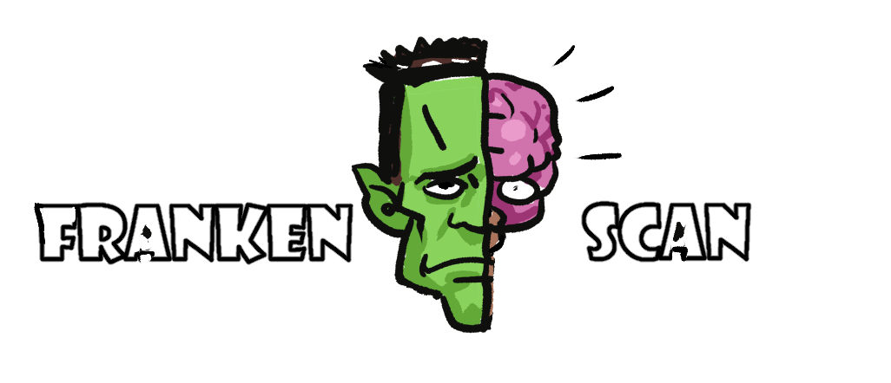
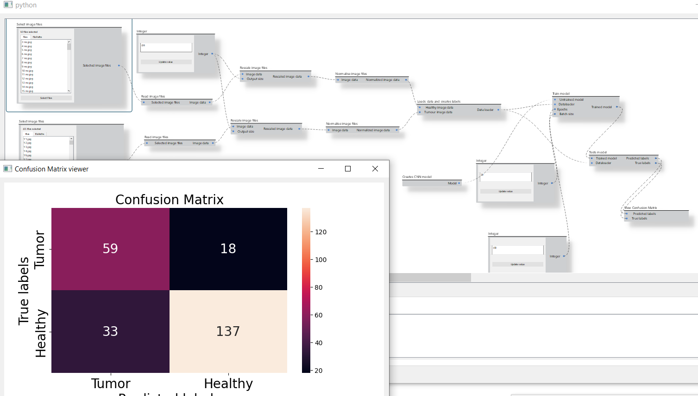

Code by Robert Sharp (Software Engineering Masters Graduate from University of Melbourne).

FrankenScan is a flow based tool for processing and analysing scan data.

FrankenScan uses the Ryvencore library.

FrankenScan currently only has 18 modules. It supports the workflow of taking 2d images of healthy and tumour patients and training and evaluating a CNN model.

While the concept behind FrankenScan is based on ScanFlow (University of Melbourne project) the code has been started from scratch and so is not subject to any copyright relating to ScanFlow.

Dependencies:

Ryvencore (https://github.com/leon-thomm/ryvencore-qt),
Pyside2, pyvistaqt, matplotlib, torch, numpy

This project uses the Fugue Icon set as placeholder icons.

https://p.yusukekamiyamane.com/